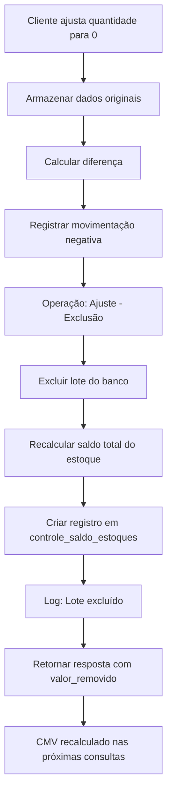
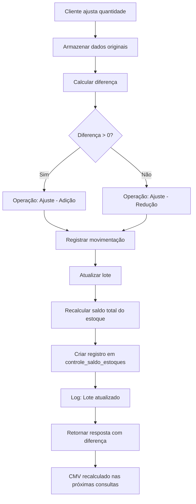

# Documentação: Melhoria na Função de Atualização de Estoque com Ajuste de CMV

**Data**: 2025-12-12  
**Desenvolvedor**: Sistema Antigravity  
**Arquivo Modificado**: `app/Http/Controllers/UnidadeEstoqueController.php`  
**Função**: `update(Request $request, $loteId)`

---

## 📋 Sumário Executivo

Esta documentação descreve as melhorias implementadas na função `update` do `UnidadeEstoqueController` para resolver o problema de recálculo do CMV (Custo de Mercadoria Vendida) quando produtos são ajustados ou excluídos do estoque.

### Problema Original
- Quando o cliente ajustava a quantidade de um produto para 0, o lote não era excluído
- O saldo do estoque não era recalculado corretamente
- O CMV não refletia as mudanças (ex: permanecia em R$ 20.000 ao invés de voltar para R$ 18.000)

### Solução Implementada
- Exclusão automática de lotes quando quantidade = 0
- Registro correto de movimentações (positivas e negativas)
- Recálculo imediato do saldo de estoque
- CMV é automaticamente recalculado nas próximas consultas

---

## 🔍 Análise do Problema

### Como o CMV é Calculado

O CMV é calculado dinamicamente pelo `AnalyticService::calculateStockMetrics` usando a fórmula:

```
CMV = Estoque Inicial + Compras - Estoque Final
```

Onde:
- **Estoque Inicial**: Último registro em `controle_saldo_estoques` antes do período
- **Compras**: Movimentações com operação "Entrada" no período  
- **Estoque Final**: Último registro em `controle_saldo_estoques` até o fim do período

### Problema Identificado

A função `update` original:
1. ✅ Atualizava a quantidade do lote
2. ✅ Registrava a movimentação
3. ✅ Recalculava o saldo total
4. ❌ **NÃO excluía** o lote quando quantidade = 0
5. ❌ **NÃO diferenciava** tipos de ajuste (adição vs redução)
6. ❌ **Logging insuficiente** para auditoria

---

## 🛠️ Mudanças Implementadas

### 1. Exclusão Automática de Lotes (Quantidade = 0)

**Antes:**
```php
$lote->quantidade = $novaQuantidade; // Mesmo se 0
$lote->save();
```

**Depois:**
```php
if ($novaQuantidade == 0) {
    // Registrar movimentação de saída total
    MovimentacoesEstoque::create([
        'quantidade' => -$quantidadeOriginal, // Negativo
        'operacao' => 'Ajuste - Exclusão',
        // ...
    ]);
    
    // Excluir o lote
    $lote->delete();
    $loteExcluido = true;
}
```

**Benefícios:**
- Lotes zerados são removidos, mantendo o banco limpo
- Movimentação registra a saída total com quantidade negativa
- Rastreabilidade completa da exclusão

### 2. Diferenciação de Tipos de Ajuste

**Antes:**
```php
MovimentacoesEstoque::create([
    'operacao' => 'Ajuste', // Genérico
    // ...
]);
```

**Depois:**
```php
$tipoOperacao = $diferencaQuantidade > 0 
    ? 'Ajuste - Adição' 
    : 'Ajuste - Redução';

MovimentacoesEstoque::create([
    'operacao' => $tipoOperacao, // Específico
    // ...
]);
```

**Benefícios:**
- Histórico mais claro de operações
- Facilita auditoria e análise de movimentações
- Melhor rastreabilidade

### 3. Logging Detalhado

**Adicionado:**
```php
Log::info('Lote excluído', [
    'lote_id' => $loteId,
    'insumo_id' => $lote->insumo_id,
    'quantidade_removida' => $quantidadeOriginal,
    'valor_removido' => $valorOriginal,
    'unidade_id' => $unidade_id,
]);

Log::info('Saldo de estoque recalculado', [
    'unidade_id' => $unidade_id,
    'saldo_atual' => $saldoAtual,
    'motivo' => $motivoAjuste,
]);
```

**Benefícios:**
- Auditoria completa de todas as operações
- Facilita debugging e troubleshooting
- Rastreamento de valores removidos

### 4. Resposta API Melhorada

**Antes:**
```json
{
    "message": "Quantidade atualizada com sucesso!",
    "lote": {
        "id": 123,
        "quantidade": 0
    }
}
```

**Depois (Exclusão):**
```json
{
    "message": "Lote excluído com sucesso! O estoque foi recalculado.",
    "operacao": "exclusao",
    "lote_excluido": true,
    "valor_removido": 2000.00,
    "saldo_estoque_atual": 18000.00
}
```

**Depois (Atualização):**
```json
{
    "message": "Quantidade atualizada com sucesso! O estoque foi recalculado.",
    "operacao": "reducao",
    "lote": {
        "id": 123,
        "quantidade_anterior": 100,
        "quantidade_atual": 50,
        "diferenca": -50,
        "valor_diferenca": -500.00
    },
    "saldo_estoque_atual": 19500.00
}
```

**Benefícios:**
- Frontend recebe informações detalhadas
- Usuário vê feedback claro da operação
- Saldo atualizado disponível imediatamente

### 5. Motivo de Ajuste Dinâmico

**Antes:**
```php
'motivo_ajuste' => 'Atualização após Reajuste', // Genérico
```

**Depois:**
```php
$motivoAjuste = $loteExcluido
    ? 'Atualização após Exclusão de Lote (Quantidade = 0)'
    : 'Atualização após Ajuste de Quantidade';
```

**Benefícios:**
- Histórico de saldo mais descritivo
- Facilita entendimento de mudanças no estoque
- Melhor rastreabilidade

---

## 📊 Fluxo de Dados

### Cenário 1: Exclusão de Lote (Quantidade = 0)



### Cenário 2: Ajuste Parcial de Quantidade



---

## 💡 Exemplo Prático

### Situação Inicial
- **Produto A**: 100 unidades × R$ 10,00 = R$ 1.000,00
- **Produto B** (erro): 200 unidades × R$ 5,00 = R$ 1.000,00
- **Saldo Total**: R$ 2.000,00
- **CMV do Período**: R$ 20.000,00

### Correção (Zerar Produto B)

**Request:**
```http
PUT /api/estoque/lote/456
Content-Type: application/json

{
    "quantidade": 0
}
```

**Processamento:**
1. Sistema identifica `novaQuantidade == 0`
2. Registra movimentação:
   - `quantidade`: -200
   - `operacao`: "Ajuste - Exclusão"
   - `preco_insumo`: 5.00
3. Exclui lote ID 456
4. Recalcula saldo: R$ 1.000,00 (apenas Produto A)
5. Cria registro em `controle_saldo_estoques`:
   - `ajuste_saldo`: 1000.00
   - `motivo_ajuste`: "Atualização após Exclusão de Lote (Quantidade = 0)"

**Response:**
```json
{
    "message": "Lote excluído com sucesso! O estoque foi recalculado.",
    "operacao": "exclusao",
    "lote_excluido": true,
    "valor_removido": 1000.00,
    "saldo_estoque_atual": 1000.00
}
```

### Resultado Final
- **Saldo Total**: R$ 1.000,00
- **CMV Recalculado**: R$ 18.000,00 (nas próximas consultas)
- **Diferença**: -R$ 2.000,00 ✅

---

## 🔐 Segurança e Transações

### Transação de Banco de Dados

Todas as operações são executadas dentro de uma transação:

```php
DB::beginTransaction();
try {
    // Operações...
    DB::commit();
} catch (\Exception $e) {
    DB::rollBack();
    Log::error('Erro ao atualizar lote: ' . $e->getMessage());
    return response()->json(['error' => '...'], 500);
}
```

**Garantias:**
- ✅ Atomicidade: Todas as operações ou nenhuma
- ✅ Consistência: Dados sempre em estado válido
- ✅ Rollback automático em caso de erro
- ✅ Logging de exceções para debugging

### Validação de Dados

```php
$request->validate([
    'quantidade' => 'required|numeric|min:0',
]);
```

**Proteções:**
- ✅ Quantidade obrigatória
- ✅ Deve ser numérica
- ✅ Não pode ser negativa

---

## 📈 Impacto no CMV

### Antes da Implementação
- Lotes com quantidade 0 permaneciam no banco
- Saldo do estoque incluía valores zerados
- CMV não refletia correções de estoque
- Histórico de movimentações genérico

### Depois da Implementação
- Lotes zerados são excluídos automaticamente
- Saldo do estoque sempre preciso
- CMV recalculado corretamente nas consultas
- Histórico detalhado e rastreável

### Fórmula do CMV (Inalterada)

```
CMV = Estoque Inicial + Compras - Estoque Final
```

**O que mudou:**
- **Estoque Final** agora reflete exclusões de lotes
- Novo registro em `controle_saldo_estoques` após cada ajuste
- CMV automaticamente correto nas próximas consultas ao `AnalyticService`

---

## 🗄️ Estrutura de Dados

### Tabela: `unidade_estoque`

| Campo | Tipo | Descrição |
|-------|------|-----------|
| id | int | ID do lote |
| insumo_id | int | ID do produto |
| fornecedor_id | int | ID do fornecedor |
| quantidade | decimal | Quantidade em estoque |
| preco_insumo | decimal | Preço unitário |
| unidade_id | int | ID da unidade |
| created_at | timestamp | Data de criação |
| updated_at | timestamp | Data de atualização |

**Mudança:** Lotes com `quantidade = 0` são **excluídos** ao invés de mantidos.

### Tabela: `movimentacoes_estoques`

| Campo | Tipo | Descrição |
|-------|------|-----------|
| id | int | ID da movimentação |
| insumo_id | int | ID do produto |
| fornecedor_id | int | ID do fornecedor |
| usuario_id | int | ID do usuário |
| quantidade | decimal | Quantidade (+ ou -) |
| preco_insumo | decimal | Preço unitário |
| operacao | string | Tipo de operação |
| unidade_id | int | ID da unidade |
| created_at | timestamp | Data da movimentação |

**Mudança:** Campo `operacao` agora pode ter valores:
- `"Entrada"` - Compra de produtos
- `"Saída"` - Consumo de produtos
- `"Ajuste - Adição"` - Aumento de quantidade
- `"Ajuste - Redução"` - Redução de quantidade
- `"Ajuste - Exclusão"` - Exclusão de lote (quantidade negativa total)

### Tabela: `controle_saldo_estoques`

| Campo | Tipo | Descrição |
|-------|------|-----------|
| id | int | ID do registro |
| ajuste_saldo | decimal | Valor total do estoque |
| data_ajuste | timestamp | Data do ajuste |
| motivo_ajuste | string | Motivo do ajuste |
| unidade_id | int | ID da unidade |
| responsavel_id | int | ID do responsável |
| created_at | timestamp | Data de criação |
| updated_at | timestamp | Data de atualização |

**Mudança:** Campo `motivo_ajuste` agora pode ter valores:
- `"Atualização após Exclusão de Lote (Quantidade = 0)"`
- `"Atualização após Ajuste de Quantidade"`

---

## 🧪 Testes e Verificação

### Cenários de Teste

#### Teste 1: Exclusão de Lote
```
1. Criar um lote de teste (ex: 50 unidades × R$ 10,00)
2. Ajustar quantidade para 0
3. Verificar:
   ✅ Lote foi excluído da tabela unidade_estoque
   ✅ Movimentação registrada com quantidade -50
   ✅ Operação = "Ajuste - Exclusão"
   ✅ Saldo recalculado corretamente
   ✅ Registro criado em controle_saldo_estoques
```

#### Teste 2: Redução Parcial
```
1. Criar um lote de teste (ex: 100 unidades × R$ 5,00)
2. Ajustar quantidade para 60
3. Verificar:
   ✅ Lote atualizado com quantidade 60
   ✅ Movimentação registrada com quantidade -40
   ✅ Operação = "Ajuste - Redução"
   ✅ Saldo recalculado corretamente
```

#### Teste 3: Adição Parcial
```
1. Criar um lote de teste (ex: 50 unidades × R$ 8,00)
2. Ajustar quantidade para 80
3. Verificar:
   ✅ Lote atualizado com quantidade 80
   ✅ Movimentação registrada com quantidade +30
   ✅ Operação = "Ajuste - Adição"
   ✅ Saldo recalculado corretamente
```

#### Teste 4: Impacto no CMV
```
1. Consultar CMV antes do ajuste (ex: R$ 20.000)
2. Excluir lote de R$ 2.000
3. Consultar CMV após o ajuste
4. Verificar:
   ✅ CMV reduzido em R$ 2.000 (agora R$ 18.000)
   ✅ Estoque Final reflete a exclusão
```

### Logs Esperados

**Exclusão de Lote:**
```
[INFO] Lote excluído
{
    "lote_id": 456,
    "insumo_id": 789,
    "quantidade_removida": 200,
    "valor_removido": 1000.00,
    "unidade_id": 1
}

[INFO] Saldo de estoque recalculado
{
    "unidade_id": 1,
    "saldo_atual": 1000.00,
    "motivo": "Atualização após Exclusão de Lote (Quantidade = 0)"
}
```

**Atualização de Lote:**
```
[INFO] Lote atualizado
{
    "lote_id": 123,
    "insumo_id": 456,
    "quantidade_original": 100,
    "quantidade_nova": 60,
    "diferenca": -40,
    "valor_diferenca": -200.00,
    "unidade_id": 1
}

[INFO] Saldo de estoque recalculado
{
    "unidade_id": 1,
    "saldo_atual": 1800.00,
    "motivo": "Atualização após Ajuste de Quantidade"
}
```

---

## 📝 Código Completo da Função

```php
public function update(Request $request, $loteId)
{
    // Validação dos dados
    $request->validate([
        'quantidade' => 'required|numeric|min:0',
    ]);

    DB::beginTransaction();

    try {
        // Busca o lote pelo ID
        $lote = UnidadeEstoque::findOrFail($loteId);

        // Armazena dados originais para registro
        $quantidadeOriginal = $lote->quantidade;
        $valorOriginal = $lote->preco_insumo * $lote->quantidade;

        // Obtém a nova quantidade informada
        $novaQuantidade = floatval($request->input('quantidade'));

        // Calcula a diferença (quantidade adicionada ou removida)
        $diferencaQuantidade = $novaQuantidade - $quantidadeOriginal;
        $valorDiferenca = $diferencaQuantidade * $lote->preco_insumo;

        $unidade_id = Auth::user()->unidade_id;
        $loteExcluido = false;

        // Se a nova quantidade for 0, excluir o lote
        if ($novaQuantidade == 0) {
            // Registrar a movimentação de saída total (negativa)
            MovimentacoesEstoque::create([
                'insumo_id' => $lote->insumo_id,
                'fornecedor_id' => $lote->fornecedor_id,
                'usuario_id' => Auth::id(),
                'quantidade' => -$quantidadeOriginal, // Quantidade negativa (saída total)
                'preco_insumo' => $lote->preco_insumo,
                'operacao' => 'Ajuste - Exclusão',
                'unidade' => $lote->unidade,
                'unidade_id' => $unidade_id,
            ]);

            // Excluir o lote
            $lote->delete();
            $loteExcluido = true;

            Log::info('Lote excluído', [
                'lote_id' => $loteId,
                'insumo_id' => $lote->insumo_id,
                'quantidade_removida' => $quantidadeOriginal,
                'valor_removido' => $valorOriginal,
                'unidade_id' => $unidade_id,
            ]);
        } else {
            // Atualiza a quantidade e o timestamp
            $lote->quantidade = $novaQuantidade;
            $lote->updated_at = now();
            $lote->save();

            // Registrar a movimentação com a diferença
            $tipoOperacao = $diferencaQuantidade > 0 ? 'Ajuste - Adição' : 'Ajuste - Redução';

            MovimentacoesEstoque::create([
                'insumo_id' => $lote->insumo_id,
                'fornecedor_id' => $lote->fornecedor_id,
                'usuario_id' => Auth::id(),
                'quantidade' => $diferencaQuantidade, // Armazena a diferença (positiva ou negativa)
                'preco_insumo' => $lote->preco_insumo,
                'operacao' => $tipoOperacao,
                'unidade' => $lote->unidade,
                'unidade_id' => $unidade_id,
            ]);

            Log::info('Lote atualizado', [
                'lote_id' => $loteId,
                'insumo_id' => $lote->insumo_id,
                'quantidade_original' => $quantidadeOriginal,
                'quantidade_nova' => $novaQuantidade,
                'diferenca' => $diferencaQuantidade,
                'valor_diferenca' => $valorDiferenca,
                'unidade_id' => $unidade_id,
            ]);
        }

        // Recalcular o saldo total do estoque (após exclusão ou atualização)
        $valorInsumos = UnidadeEstoque::where('unidade_id', $unidade_id)
            ->where('quantidade', '>', 0)
            ->sum(DB::raw('preco_insumo * quantidade'));

        $saldoAtual = $valorInsumos;

        // Criar registro de controle de saldo
        $motivoAjuste = $loteExcluido
            ? 'Atualização após Exclusão de Lote (Quantidade = 0)'
            : 'Atualização após Ajuste de Quantidade';

        DB::table('controle_saldo_estoques')->insert([
            'ajuste_saldo' => $saldoAtual,
            'data_ajuste' => now(),
            'motivo_ajuste' => $motivoAjuste,
            'unidade_id' => $unidade_id,
            'responsavel_id' => Auth::id(),
            'created_at' => now(),
            'updated_at' => now(),
        ]);

        Log::info('Saldo de estoque recalculado', [
            'unidade_id' => $unidade_id,
            'saldo_atual' => $saldoAtual,
            'motivo' => $motivoAjuste,
        ]);

        DB::commit();

        // Resposta diferenciada baseada na operação
        if ($loteExcluido) {
            return response()->json([
                'message' => 'Lote excluído com sucesso! O estoque foi recalculado.',
                'operacao' => 'exclusao',
                'lote_excluido' => true,
                'valor_removido' => $valorOriginal,
                'saldo_estoque_atual' => $saldoAtual,
            ], 200);
        } else {
            return response()->json([
                'message' => 'Quantidade atualizada com sucesso! O estoque foi recalculado.',
                'operacao' => $diferencaQuantidade > 0 ? 'adicao' : 'reducao',
                'lote' => [
                    'id' => $lote->id,
                    'quantidade_anterior' => $quantidadeOriginal,
                    'quantidade_atual' => $lote->quantidade,
                    'diferenca' => $diferencaQuantidade,
                    'valor_diferenca' => $valorDiferenca,
                ],
                'saldo_estoque_atual' => $saldoAtual,
            ], 200);
        }
    } catch (\Exception $e) {
        DB::rollBack();
        Log::error('Erro ao atualizar lote: ' . $e->getMessage(), [
            'lote_id' => $loteId,
            'exception' => $e,
        ]);
        return response()->json(['error' => 'Erro ao atualizar quantidade. Tente novamente mais tarde.'], 500);
    }
}
```

---

## 🎯 Conclusão

### Objetivos Alcançados
✅ Lotes com quantidade 0 são excluídos automaticamente  
✅ Movimentações registradas com tipos específicos (Adição/Redução/Exclusão)  
✅ Saldo de estoque recalculado em tempo real  
✅ CMV reflete corretamente as mudanças no estoque  
✅ Logging detalhado para auditoria  
✅ Respostas API informativas  
✅ Transações seguras com rollback  

### Benefícios
- **Precisão**: CMV sempre correto
- **Rastreabilidade**: Histórico completo de operações
- **Limpeza**: Banco de dados sem lotes zerados
- **Transparência**: Usuário vê exatamente o que aconteceu
- **Segurança**: Transações garantem consistência

### Manutenção Futura
- Código bem documentado e legível
- Logs facilitam debugging
- Estrutura modular permite extensões
- Validações protegem contra erros

---

## 🔧 Migração de Banco de Dados

### Problema com a Coluna `operacao`

Durante a implementação, foi identificado um erro ao tentar inserir os novos tipos de operação:

```
SQLSTATE[01000]: Warning: 1265 Data truncated for column 'operacao' at row 1
```

**Causa:** A coluna `operacao` estava definida como ENUM com valores fixos:
```sql
ENUM('Retirada', 'Entrada', 'Saida', 'Ajuste')
```

### Solução: Migration

Criada migration para alterar a coluna de ENUM para VARCHAR(50):

**Arquivo:** `database/migrations/2025_12_12_130513_alter_operacao_column_in_movimentacoes_estoques_table.php`

```php
<?php

use Illuminate\Database\Migrations\Migration;
use Illuminate\Database\Schema\Blueprint;
use Illuminate\Support\Facades\Schema;
use Illuminate\Support\Facades\DB;

return new class extends Migration
{
    public function up(): void
    {
        // Alterar a coluna 'operacao' de ENUM para VARCHAR(50)
        DB::statement("ALTER TABLE movimentacoes_estoques MODIFY COLUMN operacao VARCHAR(50) NOT NULL");
    }

    public function down(): void
    {
        // Reverter para ENUM original
        DB::statement("ALTER TABLE movimentacoes_estoques MODIFY COLUMN operacao ENUM('Retirada', 'Entrada', 'Saida', 'Ajuste') NOT NULL");
    }
};
```

### Execução

```bash
php artisan migrate
```

**Resultado:**
```
✓ 2025_12_12_130513_alter_operacao_column_in_movimentacoes_estoques_table (994.91ms)
```

### Novos Valores Suportados

Agora a coluna `operacao` aceita qualquer string de até 50 caracteres, incluindo:
- ✅ "Entrada"
- ✅ "Saida"
- ✅ "Retirada"
- ✅ "Ajuste"
- ✅ "Ajuste - Exclusão"
- ✅ "Ajuste - Adição"
- ✅ "Ajuste - Redução"

---

## 🎨 Correção no Frontend

### Problema com statusMap

Após a implementação, foi identificado um erro no frontend ao exibir o histórico de movimentações:

```
TypeError: Cannot read properties of undefined (reading 'icon')
```

**Causa:** O componente Vue `Index.vue` tinha um objeto `statusMap` que mapeava os tipos de operação para ícones e labels, mas não incluía os novos tipos de operação criados.

### Solução: Atualização do statusMap

**Arquivo:** `resources/js/Pages/Users/Estoque/Index.vue`

**Antes:**
```javascript
const statusMap = {
  Entrada: {
    icon: '/storage/images/arrow_back_verde.svg',
    label: 'Entrada',
  },
  Retirada: {
    icon: '/storage/images/arrow_back_red.svg',
    label: 'Retirada',
  },
  Ajuste: {
    icon: '/storage/images/icon_ajustes.svg',
    label: 'Ajuste',
  },
};
```

**Depois:**
```javascript
const statusMap = {
  Entrada: {
    icon: '/storage/images/arrow_back_verde.svg',
    label: 'Entrada',
  },
  Retirada: {
    icon: '/storage/images/arrow_back_red.svg',
    label: 'Retirada',
  },
  Saida: {
    icon: '/storage/images/arrow_back_red.svg',
    label: 'Saída',
  },
  Ajuste: {
    icon: '/storage/images/icon_ajustes.svg',
    label: 'Ajuste',
  },
  'Ajuste - Exclusão': {
    icon: '/storage/images/arrow_back_red.svg',
    label: 'Ajuste - Exclusão',
  },
  'Ajuste - Adição': {
    icon: '/storage/images/arrow_back_verde.svg',
    label: 'Ajuste - Adição',
  },
  'Ajuste - Redução': {
    icon: '/storage/images/arrow_back_red.svg',
    label: 'Ajuste - Redução',
  },
};
```

### Ícones Utilizados

- **Verde** (`arrow_back_verde.svg`): Para operações de entrada/adição
- **Vermelho** (`arrow_back_red.svg`): Para operações de saída/redução/exclusão
- **Ajuste** (`icon_ajustes.svg`): Para ajustes genéricos

### Build do Frontend

Após a correção, o frontend foi compilado:

```bash
npm run build
```

**Resultado:**
```
✓ built in 6.94s
```

---

## 📞 Suporte

Para dúvidas ou problemas relacionados a esta implementação:
1. Verificar logs em `storage/logs/laravel.log`
2. Consultar esta documentação
3. Revisar código em `app/Http/Controllers/UnidadeEstoqueController.php`

---

**Versão**: 1.0  
**Última Atualização**: 2025-12-12
